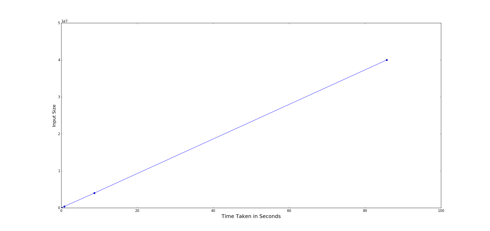

# Fan Analytics Challenge

## Features Implemented

 * List the top 10 most active host/IP addresses that have accessed the site.
 * Identify the 10 resources that consume the most bandwidth on the site
 * List the top 10 busiest (or most frequently visited) 60-minute periods
 * Detect patterns of three failed login attempts from the same IP address over 20 seconds so that all further attempts to the site can be blocked for 5 minutes

## Data Structures used

* Dictionary has been used, due to the O(1) access time by key
* Ordered Dictionary for maintaining the order of insertion of the keys
* Default Dictionary for initializing the values to defaults while declaring the dictionary
* Heap[heapq], for its self balancing property and maintaining the smallest element at the top of the heap
* Namedtuple for maintaining a light weight class structure and ease of use and understandability

## Algorithms used

* Sliding Window algorithm for calculating the busiest 60 window time periods

## Run time analysis

The program has been run in O(n) time complexity i.e. as the input is multiplied by a factor of 10, the run time is also multiplied by a factor of 10

| Number of Records | Time taken [Seconds] |
|-------------------|----------------------|
| 40                | 0.012                |
| 400               | 0.016                |
| 4000              | 0.018                |
| 40000             | 0.084                |
| 400000            | 0.832                |
| 4000000           | 8.693                |
| 40000000          | 85.70                |

Note: The run times are on my local computer, the run time might increase or decrease based on the underlying hardware. But the program still runs in O(n) time complexity

## Features that can be of business use

* Monitoring the various status code in the logs
* Number of unique hosts that have accessed the website
* Numver of daily unique visits
* Average number of requests made by host daily 

## Assumptions made

* The regex function was not able to parse around 100 KB of the data in the 460 MB of data given or in terms of records approximately 900 records in 4.5 million records. I have ignored them during the implementation of various features
* Assumed that all the records in the log file are in the same time zone '-4000'

## References

* Stackoverflow for parsing the Apache Log file